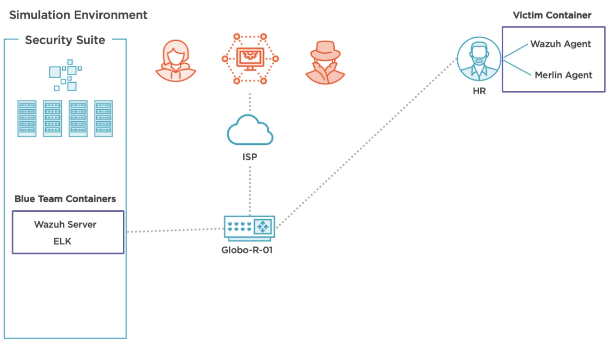

# What is this?
+ Supplementary repo for Pluralsight Course: [OS Analysis With Wazuh](https://www.pluralsight.com/courses/os-analysis-wazuh)

# Special Thanks
+ [Merlin](https://github.com/Ne0nd0g/merlin)
+ [Wazuh](https://github.com/wazuh/wazuh)
+ [libprocesshider](https://github.com/gianlucaborello/libprocesshider)

# Course Notes
1. https://github.com/wazuh/wazuh-ruleset/tree/master/rules
2. https://documentation.wazuh.com/4.0/getting-started/components/wazuh_agent.html
3. https://github.com/wazuh/wazuh-docker
4. https://documentation.wazuh.com/4.0/docker/index.html
5. https://documentation.wazuh.com/4.0/installation-guide/wazuh-agent/index.html
6. https://www.pluralsight.com/courses/command-control-merlin
7. 
8. https://localhost:8080/app/wazuh
9. https://github.com/wazuh/wazuh-ruleset/tree/v4.0.1/decoders
10. https://github.com/zachroofsec/os-analysis-with-wazuh/blob/1bfcc3e670719d3495a6600a4080e76792529c38/docker-compose.yml#L21-L25
11. https://documentation.wazuh.com/3.7/docker/container-usage.html#mount-custom-wazuh-configuration-files
12. https://documentation.wazuh.com/4.0/user-manual/ruleset/rules-classification.html
13. (https://documentation.wazuh.com/4.0/user-manual/reference/ossec-conf/active-response.html#location)
14. https://github.com/zachroofsec/os-analysis-with-wazuh/blob/master/victim-container/misc/deny-invisible-process/deny-invisible-process.py
15. https://github.com/zachroofsec/os-analysis-with-wazuh/blob/master/victim-container/misc/quarantine/quarantine.py
16. https://zachroofsec.com

# Additional Resources Slide
1. https://wazuh.com/blog/emotet-malware-detection/
2. https://wazuh.com/blog/monitoring-root-actions-on-linux-using-auditd-and-wazuh/
3. https://github.com/wazuh/wazuh/wiki/Proof-of-concept-guide
4. https://wazuh.com/blog/using-wazuh-for-windows-vulnerability-detection/
5. https://attack.mitre.org/techniques/T1574/
6. https://www.elastic.co/guide/en/kibana/7.9/introduction.html
7. https://opendistro.github.io/for-elasticsearch-docs/
